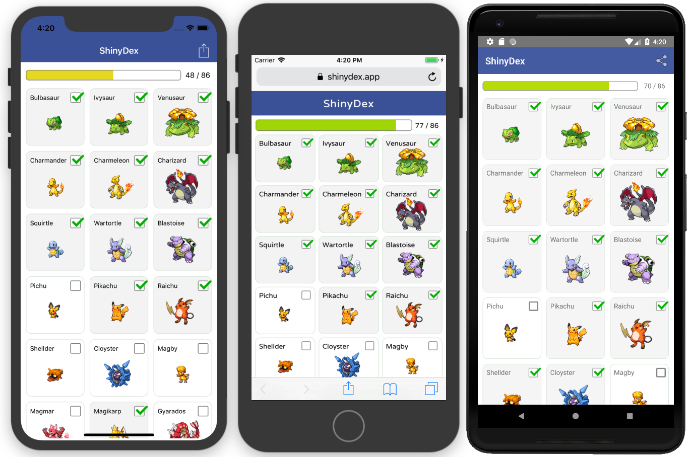

# GOChecklists

GOChecklists is a multi-platform app built with NativeScript and the Angular CLI. The app is available on [Google Play](https://play.google.com/store/apps/details?id=com.tjvantoll.GOChecklists) and [the web](https://gochecklists.app).



## Development

To run GOChecklists locally you need to install the Angular CLI, NativeScript, and NativeScript schematics. You can do so with the following commands.

```
npm install -g @angular/cli
npm install -g nativescript
npm install -g @nativescript/schematics
```

If you want to build the app for iOS or Android, you’ll additionally need to install NativeScript’s requirements for building native apps. You can find instructions on how to do that on [the NativeScript documentation site](https://docs.nativescript.org/angular/start/quick-setup).

## Running the app

GOChecklists runs on the web, on iOS, and on Android. Here are the commands you need to run the app on all three platforms.

### Web

To run the your app on the web use the Angular CLI’s `ng serve` command.

```
ng serve
```

When the command finishes, visit `localhost:4200` in your browser to see your app.

### iOS

To run your app for iOS use the following command.

```
tns run ios
```

### Android

And finally, to run your app on Android use the following command.

```
tns run android
```